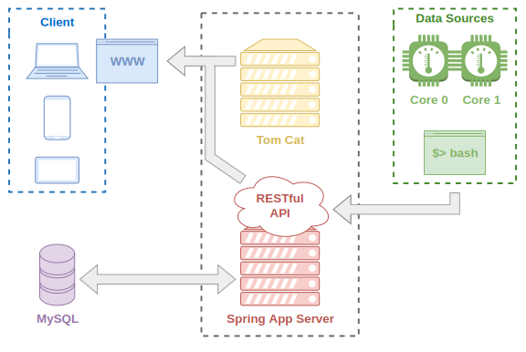

# Sensors Project

A simple project to collect and store data.
The data collection is carried out through a bash script, where the CPU temperature is collected.
The data are stored is a MySQL database and accessed using Hibernate.
A RESTful API was implemented using Spring Boot.
A web application presents the data collected.

The following figure shows the project architecture.

## Configuration

### Database

MySQL database need to be installed.
Run the script "scrip.sql" replacing "ThePassword" with a password for the database user.

### Line commands to run the server

In the terminal run the following commands, replacing "ThePassword" with the database user.

export SPRING_DATASOURCE_PASSWORD=ThePassword

./mvnw spring-boot:run
